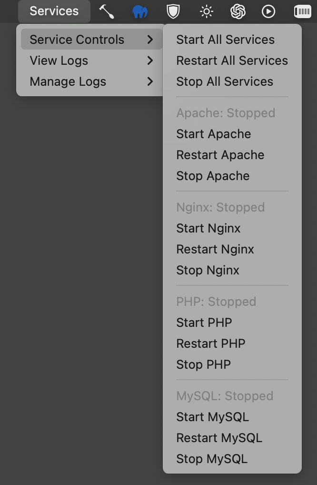
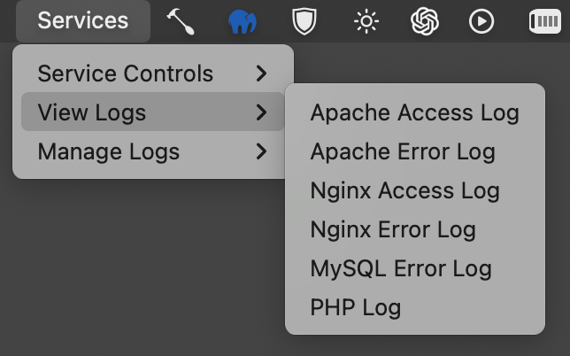
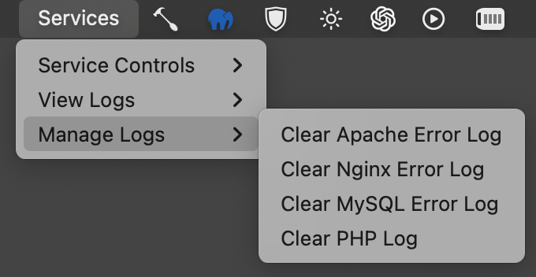

# Hammerspoon-Server-Service-Manager

A Hammerspoon script for managing Apache, Nginx, PHP, and MySQL server services directly from the macOS menu bar.

## Features
- Start, stop, and restart server services (Apache, Nginx, PHP, MySQL).
- View and clear service logs.
- Open configuration files for each service.
- Display notifications for service status changes.
- Designed to work seamlessly with the macOS menu bar.

## Requirements
- **Hammerspoon**: Make sure you have Hammerspoon installed on your Mac. You can download it from [Hammerspoon.org](https://www.hammerspoon.org).
- **Homebrew**: This script uses `brew` to manage the services, so Homebrew must be installed on your system. You can install Homebrew using the following command:
  ```bash
  /bin/bash -c "$(curl -fsSL https://raw.githubusercontent.com/Homebrew/install/HEAD/install.sh)"
  ```

## Installation
1. **Clone the repository**:
   ```bash
   git clone https://github.com/githubcom13/Hammerspoon-Server-Service-Manager.git
   ```

2. **Copy the script to your Hammerspoon configuration**:
   Move the content of the repository to your Hammerspoon configuration directory:
   ```bash
   cp Hammerspoon-Server-Service-Manager/init.lua ~/.hammerspoon/
   ```

3. **Reload Hammerspoon**:
   Open Hammerspoon and click on the "Reload Config" button or use the following command:
   ```lua
   hs.reload()
   ```

## Usage
- The script adds a menu bar icon called "Services" to your macOS menu bar.
- Click on the "Services" icon to:
  - Start, stop, or restart individual services.
  - View and clear logs for Apache, Nginx, PHP, and MySQL.
  - Open configuration files for easy editing.

## Menu Previews

### Service Controls Menu


### View Logs Menu


### Configuration Menu


## Configuration
- You can modify the services managed by this script by editing the `init.lua` file.
- To change the PHP version detected by the script, update the command in the `getPHPVersion()` function.

## Troubleshooting
- **Service Not Starting**: Make sure that the services are installed via Homebrew using `brew install httpd`, `brew install nginx`, `brew install php`, and `brew install mysql`.
- **Log Files Not Found**: Verify the paths to log files in the `init.lua` file. Paths might differ depending on your Homebrew installation.

## Contributing
Contributions are welcome! Please follow these steps to contribute:
1. Fork the repository.
2. Create a new branch (`git checkout -b feature-branch`).
3. Commit your changes (`git commit -am 'Add new feature'`).
4. Push to the branch (`git push origin feature-branch`).
5. Open a Pull Request.

## License
This project is licensed under the MIT License - see the [LICENSE](LICENSE) file for details.

## Acknowledgements
- [Hammerspoon](https://www.hammerspoon.org) for their powerful automation tools.
- [Homebrew](https://brew.sh) for package management on macOS.
